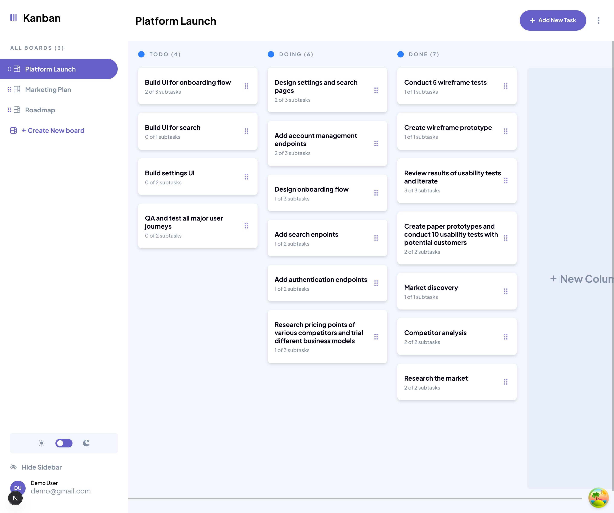
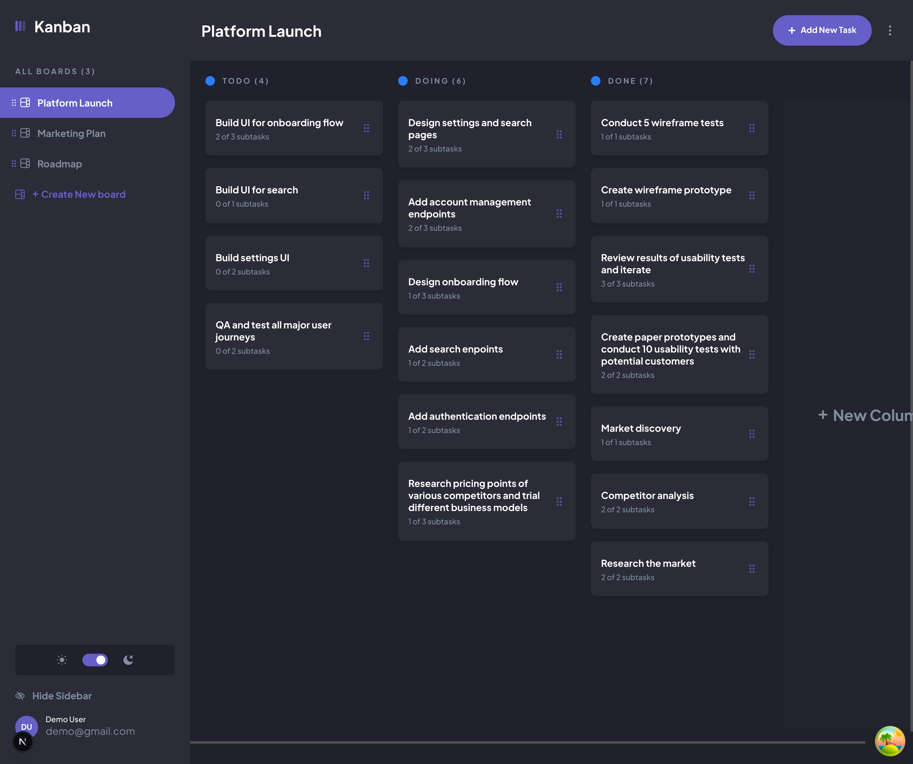
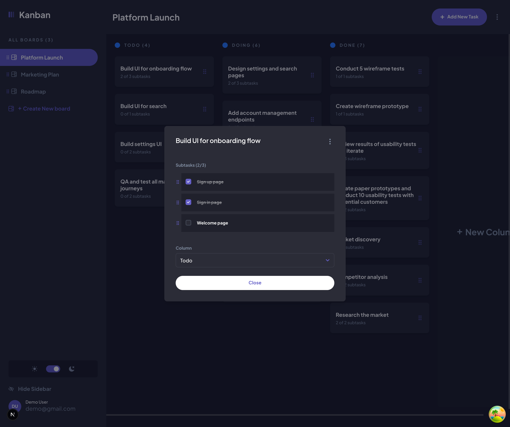
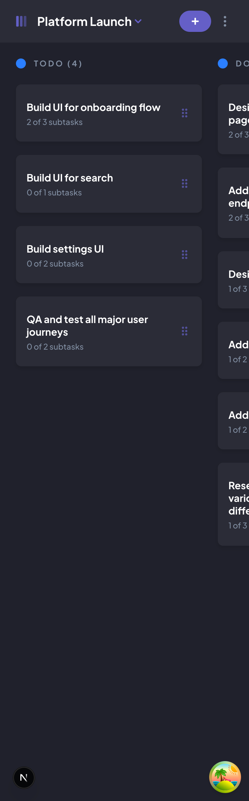
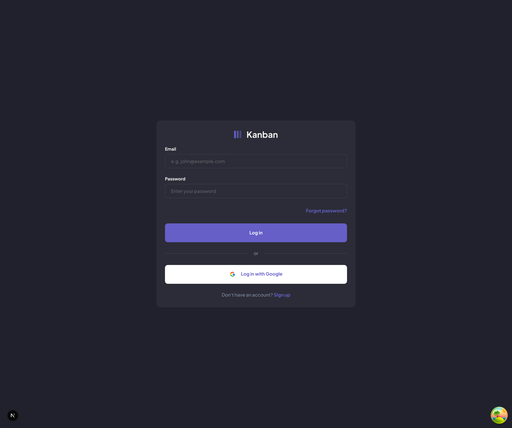

# Kanban Task Management

A full-stack Kanban-style task management application built with **Next.js 16**, **React 19**, **TypeScript**, **Prisma 7**, and **Tailwind CSS v4**. Organize your workflow with boards, columns, tasks, and subtasks — all with drag-and-drop support and a responsive dark/light theme.

> **Live Demo:** _Coming soon_

---

## Screenshots

### Board Overview — Light Mode


### Board Overview — Dark Mode


### Task Detail Modal


### Mobile View (375px)


### Login Page


---

## Features

- **Board Management** — Create, edit, delete, and reorder boards with drag-and-drop
- **Column Management** — Add and manage columns within each board
- **Task Management** — Create, view, edit, and delete tasks with full detail modals
- **Subtasks** — Break tasks into subtasks and track completion
- **Drag & Drop** — Reorder boards, tasks, and subtasks using @dnd-kit
- **Dark / Light Mode** — Toggle themes with next-themes (class-based)
- **Responsive Design** — Fully responsive layout with mobile sidebar navigation
- **Authentication** — Email/password and Google OAuth via NextAuth v5
- **Password Recovery** — Forgot password flow with email verification (Resend)
- **User Profiles** — Update name, email, and profile image
- **SSR + Hydration** — Server-side prefetching with React Query hydration for instant page loads
- **Optimistic Updates** — Smooth UI with TanStack React Query mutations

---

## Tech Stack

| Layer | Technology |
|---|---|
| **Framework** | [Next.js 16](https://nextjs.org/) (App Router, RSC, Server Actions) |
| **UI** | [React 19](https://react.dev/), [shadcn/ui](https://ui.shadcn.com/) (Radix UI) |
| **Language** | [TypeScript 5](https://www.typescriptlang.org/) |
| **Styling** | [Tailwind CSS v4](https://tailwindcss.com/), [next-themes](https://github.com/pacocoursey/next-themes) |
| **Server State** | [TanStack React Query v5](https://tanstack.com/query) |
| **Client State** | [Zustand v5](https://zustand.docs.pmnd.rs/) |
| **Forms** | [React Hook Form](https://react-hook-form.com/) + [Zod](https://zod.dev/) |
| **ORM** | [Prisma 7](https://www.prisma.io/) with PostgreSQL adapter |
| **Database** | [PostgreSQL](https://www.postgresql.org/) (hosted on [Neon](https://neon.tech/)) |
| **Auth** | [NextAuth v5](https://authjs.dev/) (Credentials + Google OAuth) |
| **Drag & Drop** | [@dnd-kit](https://dndkit.com/) |
| **Email** | [Resend](https://resend.com/) |
| **Icons** | [React Icons](https://react-icons.github.io/react-icons/), [Lucide React](https://lucide.dev/) |
| **Font** | [Plus Jakarta Sans](https://fonts.google.com/specimen/Plus+Jakarta+Sans) |

---

## Getting Started

### Prerequisites

- **Node.js** 18+
- **PostgreSQL** database (recommended: [Neon](https://neon.tech/) free tier)
- **Google OAuth** credentials (optional, for social login)

### Installation

1. **Clone the repository**

   ```bash
   git clone https://github.com/jownsu/task-management.git
   cd task-management
   ```

2. **Install dependencies**

   ```bash
   npm install
   ```

3. **Set up environment variables**

   ```bash
   cp .sample.env .env
   ```

   Fill in your `.env` file:

   ```env
   POSTGRES_URL=           # PostgreSQL connection string
   GOOGLE_CLIENT_ID=       # Google OAuth client ID
   GOOGLE_CLIENT_SECRET=   # Google OAuth client secret
   AUTH_SECRET=             # NextAuth secret (run: npx auth secret)
   ```

4. **Set up the database**

   ```bash
   npx prisma generate     # Generate Prisma client
   npx prisma db push      # Push schema to database
   npx prisma db seed      # Seed with sample data
   ```

5. **Start the dev server**

   ```bash
   npm run dev
   ```

   Open [http://localhost:3000](http://localhost:3000) in your browser.

---

## Scripts

| Command | Description |
|---|---|
| `npm run dev` | Start dev server (Turbopack) |
| `npm run build` | Production build |
| `npm run start` | Start production server |
| `npm run lint` | Run ESLint |
| `npm run mock` | Start json-server mock API (port 3001) |
| `npm run db:reset` | Reset database and run seed |
| `npx prisma studio` | Open Prisma database GUI |

---

## Project Structure

```
app/
  (auth)/               # Auth pages (login, signup, forgot/reset password)
  (pages)/              # Main app (sidebar layout)
    [board_id]/         # Board detail page
    page.tsx            # Home page
  api/auth/             # NextAuth route handler

actions/                # Server Actions (Prisma queries)
components/
  auth/                 # Auth forms
  board/                # Board CRUD modals
  columns/              # Column list, task items, drag-drop
  navigation/           # Sidebar, navbar, theme switch
  task/                 # Task CRUD modals
  ui/                   # shadcn/ui primitives

hooks/
  queries/              # useQuery + prefetch hooks
  mutations/            # useMutation hooks

store/                  # Zustand stores (board, task, column, navigation)
schema/                 # Zod validation schemas
types/                  # TypeScript types (derived from Prisma)
prisma/                 # Schema + seed data
lib/                    # Utilities, auth config, Prisma client
```

---

## Data Model

```
User
 └── Board[]
      └── Column[]
           └── Task[]
                └── Subtask[]
```

All entities use **UUIDs** as primary keys. Boards, columns, tasks, and subtasks support **custom ordering** via order arrays stored on parent entities. Deletes cascade through the entire hierarchy.

---

## Architecture Highlights

- **Server Actions + React Query** — Server Actions serve as `queryFn` for React Query, combining the benefits of server-side data access with client-side caching and optimistic updates
- **SSR Prefetching** — Pages prefetch data server-side and pass it to the client via `HydrationBoundary` for instant loads with no loading spinners
- **Zustand Modals** — All modals are controlled through Zustand stores with boolean flags, keeping modal state decoupled from component hierarchy
- **Drag & Drop** — @dnd-kit handles reordering of boards (sidebar), tasks (within/across columns), and subtasks, with order persisted to the database

---

## License

This project is for personal/educational use.

---

Built by [Jhones](https://github.com/jownsu)
